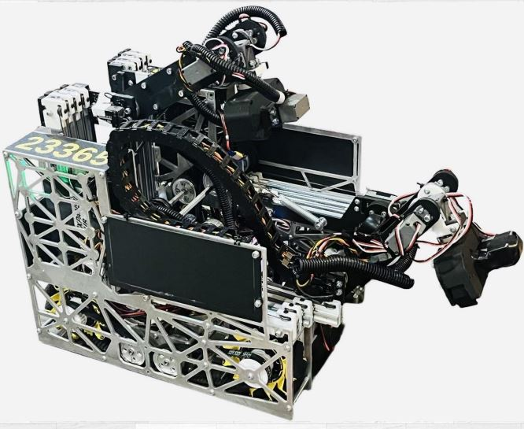

# Alpha Robotics FTC Team 23365

## OverclockedBot - INTO THE DEEP Season 2024-2025



We're a competitive FTC robotics team that builds robots designed to score fast and move faster. Our current bot measures just 14.5 × 12 inches but packs a three-axis intake system, two-axis outtake, and camera-assisted autonomous grabbing.

> For detailed documentation of our design process, iterations, and competition journey, see our [Engineering Portfolio](Team_23365_Engineering_portfolio.pdf).

## What Makes Our Robot Different

**Compact but capable.** Most teams build bigger. We went small on purpose. A 14.5 × 12 inch footprint means we can squeeze into spaces other robots can't reach, and our mecanum drivetrain keeps us nimble.

**Three-axis intake system.** Our intake extends, rotates to match sample orientation, and pivots down to grab. The camera identifies samples automatically, so the claw positions itself without driver input. Two Axon Mini servos handle the back rotation, two goBILDA speed servos manage the middle section, and a torque servo controls the claw.

**Two-axis outtake.** Unlike teams that only rotate the arm, we rotate both the arm and the claw independently. This lets us grab specimens from the observation zone, flip everything 180 degrees, and push specimens onto the high chamber in one smooth motion. Five servos total: two Axon Minis for the arm, three goBILDA torque servos for the claw and upper arm.

**Custom claw design.** Both intake and outtake claws use interlocking gear principles. The intake claw opens wide and grips tight. The outtake claw has shorter, rounded tips to avoid breakage during specimen handling.

## Autonomous

We run a 5-specimen autonomous routine using Pedro Pathing, a motion planning library built for FTC. The sequence:

1. Hook the preload specimen
2. Push samples to the observation zone
3. Pick up and hook four more specimens

Localization comes from two-wheel odometry combined with an IMU sensor:
- Parallel wheel tracks X displacement
- Perpendicular wheel tracks Y displacement  
- IMU handles heading

## Controls

### Gamepad 1 (Driver)
| Control | Action |
|---------|--------|
| Left Y Stick | Drive forward/backward |
| Left X Stick | Strafe left/right |
| Right X Stick | Rotate |
| Trigger | Slow mode |

### Gamepad 2 (Operator)
| Control | Action |
|---------|--------|
| Left Y Stick | Extend/retract intake slide |
| Buttons | Transfer, change claw angle, switch outtake preset, pick up |
| Mode switch | Toggle between intake/outtake control |

## Technical Stack

- **Framework:** FTC Robot Controller (Android)
- **Language:** Java
- **Motion Planning:** Pedro Pathing
- **Localization:** Two-wheel odometry + IMU
- **Vision:** Camera-based sample detection

## Season Results

| Event | Record | Notes |
|-------|--------|-------|
| Meet 0 | 2-3 | First robot iteration |
| Meet 1 | 3-2 | Second robot, learning the pace |
| Meet 2 | 4-1 | Event high score (248 pts) with Bread Pandas #21980 |
| Meet 3 | 5-0 | Clean sweep |
| ILT 1 | Undefeated | Winning alliance, Design Award 1st place, event high score (315 pts) with team #21982 |

## Project Structure

```
OverclockedBot/
├── FtcRobotController/     # FTC SDK and robot controller code
├── TeamCode/               # Our custom OpModes and subsystems
├── Robot.jpg               # Robot photo
└── README.md
```

## Getting Started

### Prerequisites
- Android Studio (latest stable)
- FTC SDK 10.x or later
- REV Control Hub or Expansion Hub
- Driver Station phone/tablet

### Setup
```bash
# Clone the repository
git clone https://github.com/your-org/OverclockedBot.git

# Open in Android Studio
# File -> Open -> select the project folder

# Connect to Control Hub via WiFi Direct
# Build and deploy to the robot
```

## Connect With Us

- **YouTube:** [@AlphaRoboticsFTC23365](https://www.youtube.com/@AlphaRoboticsFTC23365)
- **Instagram:** alpha-robotics 23365
- **Email:** Contact@ftcalpharoboticsftc23365

## The Team

We started this season learning from every loss. By ILT 1, we were setting event records. The robot went through three major iterations, each one fixing problems we found in competition. We talk to other teams, study their designs, and bring ideas back to the shop.

Our motto: *Always remember to fall asleep with a dream and wake up with a purpose.*

## License

This project is for educational purposes as part of FIRST Tech Challenge competition.
